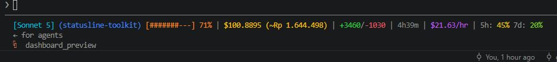

# 🧰 statusline-toolkit



[](https://github.com/gungunfebrianza/statusline-toolkit/actions/workflows/test.yml)
[](https://pypi.org/project/statusline-toolkit/)
[](LICENSE)

**New to this project? Start here.** [Claude Code](https://claude.com/product/claude-code)
is an AI coding assistant that runs in your terminal. It has a "status line" —
a small strip of text at the bottom of the screen — that can show whatever a
script tells it to. **statusline-toolkit *is* that script.** It turns the raw
data Claude Code hands it into a friendly, color-coded line showing your
model, cost, and usage — plus optional cost tracking, currency conversion,
and a visual dashboard. No coding knowledge needed to use it: install it,
run one setup command, and you're done.

```
[Claude Sonnet 5] (my-project) [####------] 42% | $0.1234 (~Rp 2.011) | +156/-23 | 45s | $9.87/hr | 5h: 24% 7d: 41%
```
*(That line above is what you'll see — model name, context used, cost, and more, all in one glance.)*

🐧 Linux · 🍎 macOS · 🪟 Windows — works the same everywhere. [MIT licensed](LICENSE).

## ✨ Features

| | |
|---|---|
| 🎨 **Color-coded summary** | A one-line status bar that turns green→amber→red as your context fills up, so you see problems before they happen. |
| 🌈 **Fully customizable colors** | Model, project, cost, burn rate, and duration each have their own color — pick your own in one config file. |
| 💱 **Any currency** | Show cost in EUR, JPY, IDR, or any world currency — not just USD. |
| 📊 **Cost tracking + dashboard** | Optionally log what every session costs, then see it as a report *or* a visual HTML chart. |
| 📏 **Never overflows** | Automatically shrinks to fit narrow terminals instead of wrapping or cutting off. |
| ⚙️ **Set it and forget it** | Save your preferred settings once; no more retyping the same flags. |
| 🧩 **Extensible** | Add your own custom info (like your git branch) with a tiny plugin file. |
| 🔒 **100% local & private** | No network calls, no accounts, no telemetry — everything lives in plain JSON files you control. |
| 🪶 **Zero dependencies** | Pure Python standard library. Nothing to `pip install` just to try it. |

## 📚 Contents

- [🚀 Quick start](#quick-start)
- [🛠️ Usage](#usage)
- [📖 Reading the summary line](#reading-the-summary-line)
- [🌈 Customizing colors](#customizing-colors)
- [🖥️ Installing as your Claude Code status line](#installing-as-your-claude-code-status-line)
- [💱 Currency conversion](#currency-conversion)
- [📊 Cost tracking: history, stats, and a dashboard](#cost-tracking-history-stats-and-a-dashboard)
- [⚙️ Personal defaults file](#personal-defaults-file)
- [🧩 Plugin segments](#plugin-segments)
- [📁 Project layout](#project-layout)
- [🧪 Tests](#tests)
- [❓ Troubleshooting](#troubleshooting)

## 🚀 Quick start

Requires Python 3.9+ (`python3` on Linux/macOS, `py` on Windows — most
computers already have this). Published on
[PyPI](https://pypi.org/project/statusline-toolkit/) — pick one option:

```bash
# Option A (recommended): pipx — installs the CLI and handles PATH for you
pipx install statusline-toolkit
statusline-toolkit --setup

# Option B: plain pip
pip install statusline-toolkit
statusline-toolkit --setup

# Option C: clone and run directly, no install step at all
git clone https://github.com/gungunfebrianza/statusline-toolkit.git
cd statusline-toolkit
python statusline_toolkit.py --input sample_statusline_data.json --idr
python statusline_toolkit.py --setup
```

That single `--setup` command is all most people need — it wires this
tool into Claude Code automatically. Restart Claude Code and you're done.

All three install options are equivalent and zero-dependency either way.
The rest of this README uses `python statusline_toolkit.py ...`; swap in
`statusline-toolkit ...` if you installed via pip/pipx.

> 💡 **`pip install` warns the script isn't on PATH?** That's a normal
> Windows/pip thing, not a bug — either use `pipx` instead (handles this
> automatically), or run it via `python -m statusline_toolkit ...`, which
> works regardless of PATH.

## 🛠️ Usage

```bash
# Live: pipe whatever JSON Claude Code sends on stdin
some_producer_of_json | python statusline_toolkit.py

# Offline: inspect a saved payload
python statusline_toolkit.py --input sample_statusline_data.json --all   # full JSON
python statusline_toolkit.py --input sample_statusline_data.json --list # just the field names
python statusline_toolkit.py --input sample_statusline_data.json --field cost.total_cost_usd

# Currency conversion (any ISO 4217 code — the 3-letter codes like EUR, JPY, IDR)
python statusline_toolkit.py --input sample_statusline_data.json --currency EUR

# No colors (for logging, or a terminal that mangles ANSI)
python statusline_toolkit.py --input sample_statusline_data.json --no-color
```

### Flag reference

| Flag | Description |
|---|---|
| `-i, --input PATH` | Read the JSON payload from a file instead of stdin. |
| `-a, --all` | Print the entire payload as formatted JSON. |
| `-l, --list` | List every available field path, without values. |
| `-f, --field DOT.PATH` | Print just this field; repeatable. |
| `--currency CODE` | Show cost converted to `CODE` (e.g. `EUR`, `JPY`, `IDR`). |
| `--idr` | Shorthand for `--currency IDR` (backward compatible). |
| `--rate RATE` | Override the conversion rate for this run only. |
| `--rate-file PATH` | Use a different exchange-rate file. |
| `--no-color` | Disable ANSI colors (also honors `NO_COLOR`). |
| `--width N` | Override the detected terminal width for adaptive layout. |
| `--no-adapt` | Never drop segments to fit the width — always the full line. |
| `--setup` | Install as your Claude Code `statusLine`, then exit. |
| `-y, --yes` | With `--setup`, skip the overwrite confirmation. |
| `--settings-file PATH` | With `--setup`, target a different `settings.json`. |
| `--track` | Record this session's cost to history, for `--stats`/`--dashboard`. |
| `--stats` | Print a cost report from tracked history, then exit. |
| `--by-project` / `--by-model` | With `--stats`, group by project/model instead of day. |
| `--history-file PATH` | Use a different history file. |
| `--dashboard` | Render an HTML usage dashboard from tracked history, then exit. |
| `--dashboard-file PATH` | Where to write the dashboard (default: next to the history file). |
| `--open` | With `--dashboard`, open it in your browser. |
| `--config PATH` | Use a different [personal defaults file](#personal-defaults-file). |
| `--plugins-dir PATH` / `--no-plugins` | Custom [plugin](#plugin-segments) directory / skip loading plugins. |
| `--version` | Print the version and exit. |

Run `--help` any time for the same reference from the source.

## 📖 Reading the summary line

```
[Claude Sonnet 5] (my-project) [####------] 42% | $0.1234 (~Rp 2.011) | +156/-23 | 45s | $9.87/hr | 5h: 24% 7d: 41%
```

| Segment | Meaning | Default color |
|---|---|---|
| `[Claude Sonnet 5]` | 🤖 Model name. | 🔵 cyan |
| `(my-project)` | 📂 Current project folder — helps tell sessions apart. | 🔵 blue |
| `[####------] 42%` | 🎯 Context window used, color-coded green→amber→red. | gradient |
| `$0.1234 (~Rp 2.011)` | 💵 USD cost, plus a converted estimate if `--currency`/`--idr` is passed. | 🟡 yellow |
| `+156/-23` | ➕➖ Lines added/removed, colored git-style (green/red). | 🟢/🔴 fixed |
| `45s` | ⏱️ Session duration. | ⚪ gray |
| `$9.87/hr` | 🔥 **Burn rate** — cost extrapolated to an hourly pace (a derived number, not a raw field). | 🟣 magenta |
| `5h: 24% 7d: 41%` | 📈 5-hour / 7-day rate-limit usage. | gradient |

Any segment just disappears if the payload doesn't have that data — nothing errors.

**Colors** blend smoothly from green (low) to amber to red (high) on the
usage bars, and every other segment above gets its own solid color, on
terminals with 24-bit color support — falling back to plain basic-ANSI
colors otherwise. `--no-color` or `NO_COLOR=1` turns all of it off. Want
different colors? See [🌈 Customizing colors](#customizing-colors).

**Adaptive width:** if the full line wouldn't fit your terminal, the least
essential segments drop first — rate limits, then burn rate, duration,
lines, project, currency — until it fits, or down to just
`[model] [bar] % | $cost` if space is very tight. Use `--width N` to set
the width explicitly (handy since Claude Code runs this headless, so
there's often nothing real to detect) or `--no-adapt` to always print the
full line.

## 🌈 Customizing colors

Five segments — **model**, **project**, **cost**, **burn rate**, and
**duration** — each have their own solid color, and you can change any of
them without touching any code. Add a `colors` object to your
[personal defaults file](#personal-defaults-file) (`~/.claude/statusline-toolkit.json`):

```json
{
  "colors": {
    "model": "orange",
    "project": "purple",
    "cost": "#00FF7F",
    "burn_rate": "red",
    "duration": "white"
  }
}
```

Every key is optional — only set the ones you want to change; anything you
leave out keeps its default. You can use either:

- **A color name**: `black`, `red`, `green`, `yellow`, `blue`, `magenta`,
  `cyan`, `white`, `gray`/`grey`, `orange`, or `purple`.
- **A hex code**: e.g. `"#FF8800"`, for exact color matching on terminals
  with 24-bit color support (falls back to plain white otherwise).

If a value is misspelled or invalid, that one segment quietly keeps its
default color instead of breaking — nothing ever errors because of a typo
in your color config. `--no-color`/`NO_COLOR` disables custom colors the
same way it disables everything else.

## 🖥️ Installing as your Claude Code status line

```bash
python statusline_toolkit.py --setup                       # default: IDR
python statusline_toolkit.py --setup --currency EUR         # a different currency
python statusline_toolkit.py --setup --currency EUR --track # also track cost history
```

This detects your OS and writes a `statusLine` entry into
`~/.claude/settings.json`, backing up any existing config first. It's
idempotent (safe to re-run) and asks before overwriting a different
`statusLine` (skip with `-y`). Restart Claude Code afterward to see it
take effect.

## 💱 Currency conversion

`exchange_rate.json` holds manually maintained rates you control — no
network calls, no API keys:

```json
{
  "rates": { "IDR": 16300, "EUR": 0.92 },
  "updated_at": "2026-07-06"
}
```

Add a currency to `rates` and pass `--currency CODE`, or use
`--currency CODE --rate <value>` for a one-off conversion without
touching the file. If a currency isn't configured, the script tells you
exactly what to add rather than guessing. If `updated_at` is over 30 days
old, you'll get a one-line reminder to refresh it.

(Older single-currency files — `{"usd_to_idr": 16300, ...}` — still work unchanged.)

## 📊 Cost tracking: history, stats, and a dashboard

`--track` records each session's cost to `usage_history.json` (keyed by
session, so re-renders don't double-count). Then:

```bash
python statusline_toolkit.py --input sample_statusline_data.json --track
python statusline_toolkit.py --stats                 # grouped by day
python statusline_toolkit.py --stats --by-project     # or by project / --by-model
python statusline_toolkit.py --dashboard --open       # visual HTML report
```

`--stats` prints a per-group cost/session breakdown with a grand total.
`--dashboard` renders the same data as a self-contained HTML file — summary
cards plus cost-by-day/project/model bar charts, no JS framework, no CDN,
light/dark aware — and only opens a browser if you pass `--open`.

A couple of details that make the dashboard easier to scan at a glance:

- Two extra summary cards, **Priciest day** and **Cheapest day**, so you
  can spot your worst/best day without reading the whole chart.
- Today's row in the "Cost by day" chart is visually highlighted with a
  **Today** badge, so you don't have to hunt for the most recent bar.

Everything here is opt-in and local: nothing is tracked or rendered unless
you ask, and `usage_history.json` is plain JSON you can inspect or delete
anytime.

## ⚙️ Personal defaults file

Tired of retyping the same flags? Put them in
`~/.claude/statusline-toolkit.json`:

```json
{
  "currency": "EUR",
  "track": true,
  "width": 100
}
```

Every key is optional and mirrors a CLI flag (`no_color`, `by_project`,
`by_model`, `no_adapt`, `rate_file`, `history_file`, `plugins_dir`,
`no_plugins` are all supported too). **CLI flags always override the
file.** Use `--config PATH` for a different file (e.g. separate
personal/work profiles).

There's one config-only setting with no matching flag: `colors`, for
[customizing the summary line's colors](#customizing-colors) — see that
section for the full list of options.

## 🧩 Plugin segments

Add your own segment (git branch, whatever) without touching the script:
drop a `.py` file into `~/.claude/statusline-plugins/` defining one function.

```python
# ~/.claude/statusline-plugins/git_branch.py
import subprocess

def segment(data: dict, use_color: bool) -> str | None:
    cwd = data.get("workspace", {}).get("current_dir") or data.get("cwd")
    try:
        branch = subprocess.run(
            ["git", "branch", "--show-current"], cwd=cwd, capture_output=True, text=True, timeout=1,
        ).stdout.strip()
    except Exception:
        return None
    return f"({branch})" if branch else None
```

The filename becomes the segment's name; return `None`/`""` to hide it for
a render. An optional `PRIORITY: int` (default `0`) controls drop order
among plugins — but plugin segments always drop before any built-in one.
**A broken plugin (syntax error, exception, bad return type) is silently
skipped, never crashes the statusline.** Disable loading with
`--no-plugins`, or point elsewhere with `--plugins-dir`.

> ⚠️ **Security note:** a plugin is a regular Python file that runs with
> full permissions on every render — there's no sandboxing. Only put
> plugins in this folder that you wrote yourself or fully trust, the same
> way you'd treat any script before running it. Never copy a plugin from
> an untrusted source without reading it first.

## 📁 Project layout

| File | Purpose |
|---|---|
| `statusline_toolkit.py` | The CLI, including the `--setup` installer. |
| `exchange_rate.json` | Your USD→currency rates. |
| `sample_statusline_data.json` | Example payload for trying the tool offline. |
| `test_statusline_toolkit.py` | Unit tests. |
| `CHANGELOG.md` | What changed, release by release. |
| `LICENSE` | MIT license. |
| `pyproject.toml` | Packaging metadata, for `pip`/`pipx install`. |
| `.github/workflows/test.yml` | CI: runs the test suite on Linux/macOS/Windows for every push and PR. |

`usage_history.json`, `usage_dashboard.html`, `settings.json.bak`, and
`~/.claude/statusline-toolkit.json` are all generated on demand — not
part of a fresh checkout, safe to delete anytime.

## 🧪 Tests

```bash
python -m unittest test_statusline_toolkit.py -v
```

Standard library `unittest` only — no test runner to install.

## ❓ Troubleshooting

<details>
<summary><strong>"No input JSON received" / "Input is not valid JSON"</strong></summary>

Pass `--input sample_statusline_data.json` (or your own file), or pipe
valid JSON into stdin.
</details>

<details>
<summary><strong>Colors look garbled, or the gradient looks banded instead of smooth</strong></summary>

Your terminal doesn't support ANSI/truecolor — use `--no-color`, or run in
a modern terminal (Windows Terminal, a current PowerShell, most
Linux/macOS terminal apps).
</details>

<details>
<summary><strong>Windows: "python is not recognized..."</strong></summary>

Use the `py` launcher instead (`py statusline_toolkit.py ...`), or
reinstall Python with "Add python.exe to PATH" checked.
</details>

<details>
<summary><strong>"statusline-toolkit.exe is installed in ... which is not on PATH"</strong></summary>

A normal `pip install` warning on Windows when installing outside a
virtualenv — not a bug. Either reinstall with `pipx install
statusline-toolkit` (handles PATH for you), or just run
`python -m statusline_toolkit ...` instead of the bare `statusline-toolkit`
command; it works regardless of PATH.
</details>

<details>
<summary><strong>`--setup` didn't seem to take effect</strong></summary>

Restart Claude Code — `statusLine` config is only read at session start.
Check `~/.claude/settings.json` for a `statusLine` block pointing at
`statusline_toolkit.py`.
</details>
